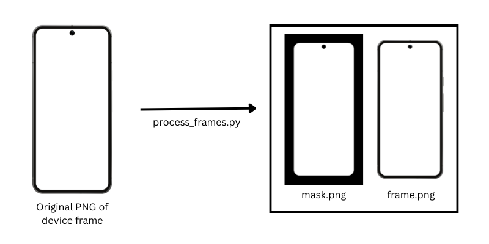
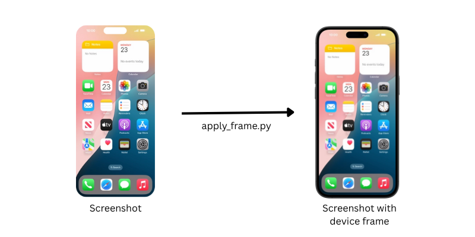

# device-frames
Apply a device frame to a screenshot. Create mockups easily.

This repository provides three main ways to work with device frames:
1. **CLI Script**: `apply_frame.py` - Command-line tool
2. **HTTP API**: FastAPI service for remote/web usage
3. **Python Engine**: Reusable library for custom integrations

---

## 🚀 Quick Start

### CLI Usage
```bash
python apply_frame.py \
  --screenshot test-screenshots/iphone16plus.png \
  --device-type "16 Plus" \
  --device-variation "Teal" \
  --output marketing/hero-image.png
```

### API Usage
```bash
# Start the server
./start_api.sh
# or
uvicorn api.main:app --host 0.0.0.0 --port 8000

# Make a request
curl -X POST http://localhost:8000/apply_frame \
  -F "file=@screenshot.png" \
  -F "device_type=16 Plus" \
  -F "device_variation=Teal" \
  -o framed.png
```

**Interactive API docs**: http://localhost:8000/docs

📖 **Full API documentation**: See [docs/API.md](docs/API.md)

### Python Engine
```python
from pathlib import Path
from engine import apply_frame_to_screenshot, find_template

# Find device template
template_path, _ = find_template(
    Path("device-frames-output"), 
    "16 Plus", 
    "Teal"
)

# Apply frame
apply_frame_to_screenshot(
    screenshot_path=Path("screenshot.png"),
    template_path=template_path,
    output_path=Path("output.png")
)
```

---

# Project Structure

```
device-frames/
├── engine/              # Pure frame application logic (no HTTP/CLI)
│   ├── apply_frame.py  # Core frame application
│   ├── color.py        # Color parsing
│   └── templates.py    # Template discovery
│
├── api/                # FastAPI HTTP service
│   ├── main.py        # App instance
│   └── routes.py      # /apply_frame endpoint
│
├── apply_frame.py      # CLI script
├── device-frames-output/  # Processed templates
└── device-frames-raw/     # Original frame images
```

---

# Processing frames
  
Each frame is originally a png, stored in `/device-frames-raw`. In order to put a screenshot within the frame though, we need a mask. `process_frames.py` creates masks and a template.json with important information for each frame, and stores them within `/device-frames-output`.

**Algorithm Overview**

#### Step 1: Normalize Image
- Load PNG and convert to RGBA
- Extract alpha channel (0-255 range)

#### Step 2: Classify Pixels by Opacity
- **Transparent** (α ≤ 10): Screen interior
- **Solid** (α ≥ 245): Device frame
- **Edge/anti-aliased**: Everything in between

#### Step 3: Find Contiguous Transparent Regions
- Connected-component labeling on transparency mask
- Identify all transparent regions with their areas
- Reject regions touching image borders (background)
- Reject tiny regions (holes, speaker grills, < 5000 pixels)

#### Step 4: Select Screen Candidate
Chooses the region with:
- Largest area
- Aspect ratio within 1.3-2.5 range (phones & tablets)
- Fully enclosed by opaque pixels

#### Step 5-6: Extract Bounds & Contour
- Calculate minX, minY, maxX, maxY of selected region
- Generate bounding box
- Extract precise screen contour using edge detection

#### Step 7: Generate Screen Mask
- Create blank image (frame size)
- Fill detected contour with white (255)
- Fill background with black (0)
- Feather inward by ~1px to avoid edge bleed


### Output structure:

Each processed frame generates 3 files in `device-frames-output/`:

```
device-frames-output/
├── {device-type}/
│   └── {device-model}/
│       └── {color-variant}/
│           ├── frame.png         (original frame, RGBA, transparent background)
│           ├── mask.png          (binary screen mask, grayscale)
│           └── template.json     (metadata: coordinates, sizes)
```

### Output Format

**template.json** - Metadata for each device frame:  
```json
{
  "frame": "frame.png",
  "mask": "mask.png",
  "screen": {
    "x": 183,
    "y": 169,
    "width": 1145,
    "height": 2549
  },
  "frameSize": {
    "width": 1511,
    "height": 2896
  }
}
```

**Fields:**
- `frame`: Relative path to RGBA frame image
- `mask`: Relative path to binary screen mask (white=screen, black=background)
- `screen.x, y`: Top-left corner of screen bounding box
- `screen.width, height`: Screen dimensions
- `frameSize`: Full frame dimensions

#### `frame.png`
Original device frame (copy) with transparent background

#### `mask.png`
Binary mask where:
- **White (255)**: Screen region
- **Black (0)**: Everything else


---


# Applying frames


```bash
python apply_frame.py \
  --screenshot path/to/screenshot.png \
  --device-type "16 Pro Max" \
  --device-variation "Natural Titanium" \
  [--background-color "#RRGGBB"|"#RRGGBBAA"]
```


### Options

- `--screenshot` (required): Path to your screenshot image
- `--device-type` (required): Device model name (e.g., "16 Pro Max", "Pixel 9 Pro XL", "Pixel Tablet")
- `--device-variation` (required): Color/finish variant (e.g., "Natural Titanium", "Rose Quartz", "Hazel")
- `--output`: Custom output path (default: `mockup/<device>-<variation>-framed.png`)
- `--output-dir`: Output directory (default: `mockup/`)
- `--output-root`: Templates location (default: `output/`)
- `--background-color`: Background color as hex (`#RRGGBB` or `#RRGGBBAA`). Default is transparent. The color fills the area behind and around the device frame, including any padding from 3D rotation.

### Examples

**iPhone 15 Pro Max:**
```bash
python apply_frame.py \
  --screenshot test-screenshots/iphone-15-pro.jpeg \
  --device-type "15 Pro Max" \
  --device-variation "Natural Titanium"
```

**Pixel Tablet:**
```bash
python apply_frame.py \
  --screenshot test-screenshots/tablet-screenshot.png \
  --device-type "Pixel Tablet" \
  --device-variation "Hazel"
```

**Custom output location:**
```bash
python apply_frame.py \
  --screenshot test-screenshots/iphone16plus.png \
  --device-type "16 Plus" \
  --device-variation "Teal" \
  --output test-mockups/image.png
```

### How It Works

1. Loads the device frame and mask from the template
2. Resizes your screenshot to fit the screen region exactly
3. Applies the mask to give the screenshot rounded corners/notch cutouts
4. Composites the masked screenshot behind the device frame
5. Saves the final image with proper transparency

The mask is slightly dilated to eliminate subpixel gaps at rounded corners and notches.

---

# Devices:
- Android phones (Pixel 8, 8 Pro, 9 Pro, 9 Pro XL)
- Android tablets (Pixel Tablet, Samsung Galaxy Tab S11 Ultra)
- iOS phones (iPhone 13 mini, 14 Pro Max, 15 Pro Max, 16, 16 Plus, 16 Pro, 16 Pro Max, 17 Pro, 17 Pro Max, Air)
- iPads (Air, mini, Pro 11", Pro 13")

**View all available devices with their frame dimensions**:

```bash
python list_devices_and_frame_sizes.py
```

```
Found 110 devices:

============================================================
ANDROID-PHONE
============================================================
Pixel 8 - Hazel: 1511x2896px
Pixel 9 Pro XL - Rose Quartz: 1684x3272px
...

============================================================
IOS
============================================================
16 Pro Max - Natural Titanium: 1490x2996px
...
```

Use this to:
- Find exact device model names for `--device-type` parameter
- Find available color variations for `--device-variation` parameter
- Check frame dimensions for your designs

---

# Installation

```bash
pip install -r requirements.txt
```


# Contributing:
Please add more device frames and test-screenshots.
Process all device frames:  
```bash
python process_frames.py
```

---

## Deploy to Fly.io

- Ensure the API runs on port `8000` and starts with `uvicorn`.
- This repo includes a working `Dockerfile` and `fly.toml`.

### One-time setup
```bash
brew install flyctl   # or see https://fly.io/docs/hands-on/install-flyctl/
fly auth login
fly apps create device-frames   # or use your desired app name
```

### Deploy
```bash
fly deploy
```

### Verify
- Check logs: `fly logs`
- Open app: `fly open`

### Common issues
- Error: `To use the fastapi command, please install "fastapi[standard]"` → Fix the container command to use `uvicorn api.main:app --host 0.0.0.0 --port 8000` (already set in `Dockerfile`).
- Port mismatch: `fly.toml` sets `internal_port = 8000`. Make sure your server binds to `0.0.0.0:8000` (done by default).
- Large image builds: `.dockerignore` excludes `device-frames-raw`, `tests`, and `docs` to keep images small. The API uses `device-frames-output`, which is included.