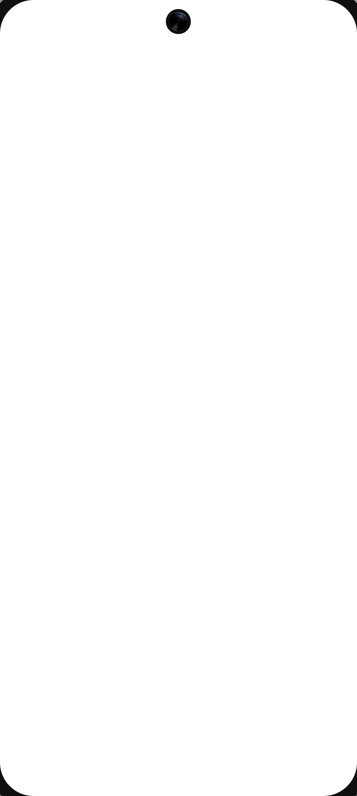
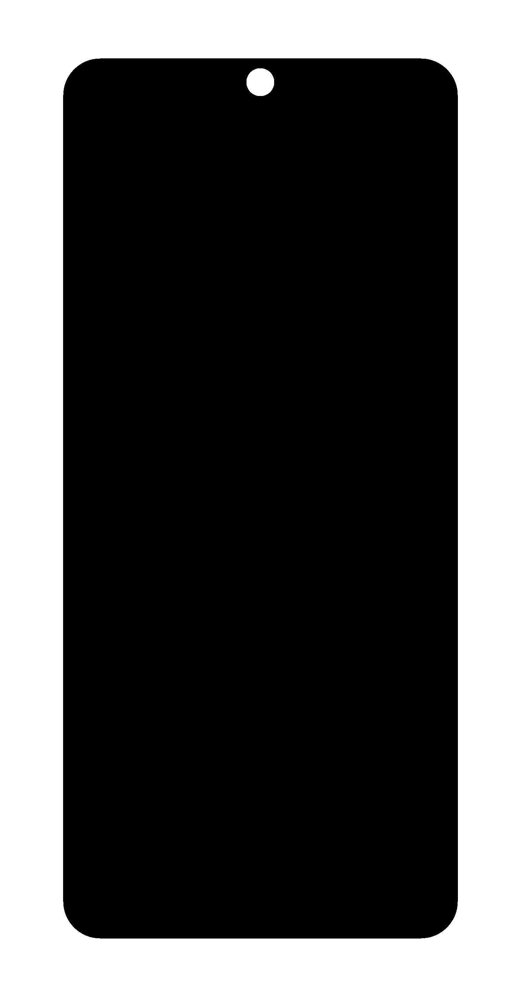

# device-frames

Automated extraction of screen regions from device frame mockups. Processes PNG device frames to generate screen masks, bounding boxes, and reusable templates.

## Features

- **Alpha-based detection**: Uses transparency information to identify screen regions
- **Contiguous region analysis**: Finds the largest transparent region enclosed by opaque pixels
- **Smart aspect ratio filtering**: Handles both portrait phones (1.7-2.4) and tablets (1.3-2.5)
- **Automatic validation**: Sanity checks ensure mask quality before output
- **Batch processing**: Recursively processes entire directory trees
- **Three-artifact output**: Each frame generates `frame.png`, `mask.png`, and `template.json`

## Algorithm Overview

### Step 1: Normalize Image
- Load PNG and convert to RGBA
- Extract alpha channel (0-255 range)

### Step 2: Classify Pixels by Opacity
- **Transparent** (α ≤ 10): Screen interior
- **Solid** (α ≥ 245): Device frame
- **Edge/anti-aliased**: Everything in between

### Step 3: Find Contiguous Transparent Regions
- Connected-component labeling on transparency mask
- Identify all transparent regions with their areas
- Reject regions touching image borders (background)
- Reject tiny regions (holes, speaker grills, < 5000 pixels)

### Step 4: Select Screen Candidate
Chooses the region with:
- Largest area
- Aspect ratio within 1.3-2.5 range (phones & tablets)
- Fully enclosed by opaque pixels

### Step 5-6: Extract Bounds & Contour
- Calculate minX, minY, maxX, maxY of selected region
- Generate bounding box
- Extract precise screen contour using edge detection

### Step 7: Generate Screen Mask
- Create blank image (frame size)
- Fill detected contour with white (255)
- Fill background with black (0)
- Feather inward by ~1px to avoid edge bleed

### Step 8: Validate Automatically
Sanity checks before output:
- Mask coverage between 50%-90% of frame area
- Mask doesn't touch image edges
- Bounding box fully encloses mask
- Non-empty mask

## Installation

```bash
pip install -r requirements.txt
```

Dependencies:
- `Pillow` - Image processing
- `numpy` - Array operations
- `scipy` - Connected-component labeling

## Visual Examples

### Original Frame (Pixel 8 - Hazel)


### Screen Extracted
The script can extract just the screen content using the template coordinates:



### Frame with Mask Applied
The mask can be used to create clean composites with the frame border:



The mask ensures precise screen boundaries, handling rounded corners and notches perfectly.

## Usage

Process all device frames:

```bash
python process_frames.py
```

### Output structure:

Each processed frame generates 3 files in `output/`:

```
output/
├── {device-type}/
│   └── {device-model}/
│       └── {color-variant}/
│           ├── frame.png         (original frame, RGBA, transparent background)
│           ├── mask.png          (binary screen mask, grayscale)
│           └── template.json     (metadata: coordinates, sizes)
```

## Output Format

### `template.json`
Metadata for each device frame:

```json
{
  "frame": "frame.png",
  "mask": "mask.png",
  "screen": {
    "x": 183,
    "y": 169,
    "width": 1145,
    "height": 2549
  },
  "frameSize": {
    "width": 1511,
    "height": 2896
  }
}
```

**Fields:**
- `frame`: Relative path to RGBA frame image
- `mask`: Relative path to binary screen mask (white=screen, black=background)
- `screen.x, y`: Top-left corner of screen bounding box
- `screen.width, height`: Screen dimensions
- `frameSize`: Full frame dimensions

### `frame.png`
Original device frame (copy) with transparent background

### `mask.png`
Binary mask where:
- **White (255)**: Screen region
- **Black (0)**: Everything else


### Devices:
- Android phones (Pixel 8, 8 Pro, 9 Pro, 9 Pro XL)
- Android tablets (Pixel Tablet, Samsung Galaxy Tab S11 Ultra)
- iOS phones (iPhone 13 mini, 14 Pro Max, 15 Pro Max, 16, 16 Plus, 16 Pro, 16 Pro Max, 17 Pro, 17 Pro Max, Air)
- iPads (Air, mini, Pro 11", Pro 13")

# Contributing:
Please add more device frames!!

